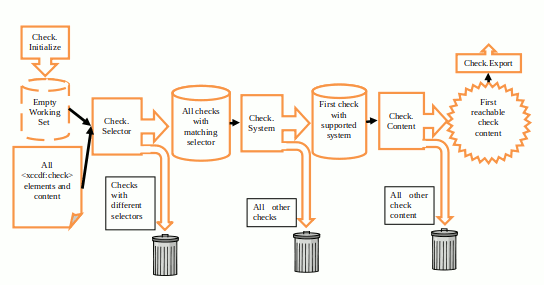
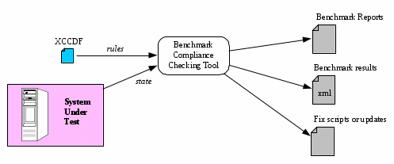

# 7. XCCDF Processing

## 7.1 Introduction

The XCCDF specification is designed to support automated XCCDF document processing by a variety of products. There are three basic types of processing that a benchmark consumer might apply to an XCCDF document:

- **Tailoring** involves loading an XCCDF benchmark document, applying customizations through the application of profiles or through user actions, and then generating an XCCDF benchmark document that incorporates the tailoring.
- **Document Generation** involves loading an XCCDF benchmark document and generating textual or formatted output, usually in a form suitable for printing or human perusal.
- **Assessing** involves loading an XCCDF benchmark document, checking target systems or data sets that represent the target systems, computing one or more scores, and generating one or more _\<xccdf:TestResult\>_ elements. Some products also generate other outputs or store compliance information in some kind of database.

XML schema validation SHOULD be performed by benchmark consumers prior to processing XCCDF benchmark documents.

Digital signature generation and validation MAY be performed by products as part of processing. However, because signatures are only valid on a source document, not valid after the document has been processed, products that perform signature validation on source documents MUST do so after XInclude processing and before performing any other processing on those documents.

## 7.2 Loading and Traversal

### 7.2.1 Introduction

Each type of processing includes two common steps: loading the XCCDF document, then traversing its contents to generate output. Loading and traversal are discussed below. Note that loading must be complete before traversal begins.

### 7.2.2 Loading

Table 32 explains the basics of the loading processing sequence.

**Table 32: Loading Processing Sequence Sub-Steps**

| Sub-Step | Description |
| --- | --- |
| Loading.Import | Import the XCCDF document into the program and build an initial internal representation of its elements and attributes. If the document cannot be read or parsed, then Loading fails. (At the beginning of this step, any inclusion processing specified with XInclude elements MUST be performed in compliance with [XINCLUDE]. The resulting XML information set should be validated against the XCCDF schema; if validation fails, then Loading fails. XML Inclusion processing is independent of all XCCDF processing and must happen before any XCCDF validation or other processing.) Go to the next sub-step. |
| Loading.Noticing | For each _\<xccdf:notice\>_ element of the _\<xccdf:Benchmark\>_ element, add the notice to the product's set of legal notices. If a notice with an identical _@id_ value is already a member of the set, then an error should be raised. Go to the next sub-step. |
| Loading.Resolve | If the _@resolved_ attribute of the _\<xccdf:Benchmark\>_ element is set to true, which asserts that the other Loading.Resolve sub-steps are unnecessary, then Loading succeeds, otherwise go to the next sub-step. |
| Loading.Resolve.Items | For each item in the _\<xccdf:Benchmark\>_ that has an _@extends_ attribute, resolve it by using the following steps:(1) resolve the extended item (i.e., perform Loading.Resolve.Items on the extended item)(2) insert the necessary property sequences from the extended item into the appropriate locations in the extending item (see Table 33 below)(3) remove the _@extends_ attribute. If any item's _@extends_ identifier does not match the identifier of a visible item of the same type, then Loading fails. If the directed graph formed by the _@extends_ attributes includes a loop, then indicate a processing error and Loading fails, otherwise go to the next sub-step. |
| Loading.Resolve.Profiles | For each _\<xccdf:Profile\>_ in the _\<xccdf:Benchmark\>_ that has an _@extends_ attribute, resolve the set of properties in the extending _\<xccdf:Profile\>_ by applying the following steps: (1) resolve the extended _\<xccdf:Profile\>_ (i.e., perform Loading.Resolve.Profiles on the extended profile)(2) insert the necessary property sequences from the extended _\<xccdf:Profile\>_ into the appropriate locations in the extending _\<xccdf:Profile\>_ (see Table 33 below) If any _@extends_ identifier does not match the identifier of another _\<xccdf:Profile\>_ in the _\<xccdf:Benchmark\>_, then Loading fails. If the directed graph formed by the _@extends_ attributes includes a loop, then indicate a processing error and Loading fails. Otherwise, go to the next sub-step. |
| Loading.Resolve.Tailoring | If no _\<xccdf:Tailoring\>_ element is being applied to this _\<xccdf:Benchmark\>_, go to the next sub-step. Otherwise, for each _\<xccdf:Profile\>_ in the _\<xccdf:Tailoring\>_ element that has an _@extends_ attribute, resolve the set of properties in the extending _\<xccdf:Profile\>_ by applying the following steps: (1) prepend the property sequence from the extended _\<xccdf:Profile\>_ to that of the extending _\<xccdf:Profile\>_ (see Table 33 below)(2) if the _\<xccdf:Profile\>_ element's _@id_ and _@extends_ attributes are both identical to the _@id_ of an _\<xccdf:Profile\>_ element in the source _\<xccdf:Benchmark\>_, then set the _@abstract_ attribute of the extended _\<xccdf:Profile\>_ in the source _\<xccdf:Benchmark\>_ to true. If any _\<xccdf:Profile\>_ _@extends_ attribute identifier does not match the identifier of another _\<xccdf:Profile\>_ in the source _\<xccdf:Benchmark\>_, then Loading fails. If any tailoring profile's identifier duplicates the identifier of a benchmark profile in the source benchmark without also extending that profile, then Loading fails. Otherwise, go to the next sub-step. |
| Loading.Resolve.Abstract | For each item in the _\<xccdf:Benchmark\>_ for which the _@abstract_ attribute is true, remove the item. Any item for which the _@abstract_ attribute is true shall not be included in any generated document and shall not be exported to any checking engine or used in any check.For each _\<xccdf:Profile\>_ in the _\<xccdf:Benchmark\>_ for which the _@abstract_ attribute is true, remove the _\<xccdf:Profile\>_. Go to the next sub-step. |
| Loading.Resolve.Finalize | Set the _\<xccdf:Benchmark\>_ _@resolved_ attribute to true; Loading succeeds. |

If Loading succeeds for an XCCDF document, the internal data model should be complete and every item should contain all of its own content. An XCCDF document that has no _@extends_ or _@abstract_ attributes is called a resolved document.

During the Loading.Resolve.Items and Loading.Resolve.Profiles steps, the processor must flatten inheritance relationships. The conceptual model for XCCDF object properties is a list of name-value pairs; property values defined in an extending object are added to the list inherited from the extending object. Where they are added to this list depends on the inheritance processing model for the given property. There are five such models:

- **None** – the property value or values are not inherited.
- **Prepend** – the property values are inherited from the extended object, but values on the extending object come first, and inherited values follow.
- **Append** – the property values are inherited from the extended object; additional values may be defined on the extending object and appear after the inherited values.
- **Replace** – the property value is inherited; a property value explicitly defined on the extending object replaces an inherited value.
- **Override** – if explicitly tagged as 'override' (by setting the _@override_ attribute to "true"), the property is processed as if it uses the Replace model. Otherwise, the property is processed as if it uses the Append model.

Table 33 shows the inheritance processing model for each of the properties supported on _\<xccdf:Rule\>_, _\<xccdf:Group\>_, _\<xccdf:Value\>_, and _\<xccdf:Profile\>_ elements.

**Table 33: Inheritance Processing Model**

| Processing Model | Properties | Remarks |
| --- | --- | --- |
| None | abstract, cluster-id, extends, id, signature, status, dc-status | These properties cannot be inherited at all; they must be given explicitly |
| Prepend | source, choices |
| Append | requires, conflicts, ident, fix, value, complex-value, default, complex-default, lower-bound, upper-bound, match, select, refine-value, refine-rule, set-value, set-complex-value, profile-note |
| Replace | hidden, prohibitChanges, selected, version, weight, operator, interfaceHint, check, complex-check, role, severity, type, interactive, multiple, note-tag, impact-metric | For the check property, checks with different systems or different selectors shall be considered different properties |
| Override | title, description, platform, question, rationale, warning, reference, fixtext | For properties that have a locale specified (xml:lang), values with different locales shall be considered different properties |

Group extension is deprecated in XCCDF 1.2; however, if it is used, the Loading.Resolve.Items step MUST generate a fresh unique id for any Group, Rule, or Value object that gets created through extension of its enclosing Group. This could be accomplished by generating and assigning a random unique id during Loading.Resolve.Items. It should be emphasized, however, that use of this feature is strongly discouraged because the lack of any standardized procedure for id generation means that tools from different vendors are unlikely to handle group extension the same way, leading to problems with interoperability.

### 7.2.3 Traversal

#### 7.2.3.1 Introduction

The second processing step is Traversal. The concept behind Traversal is basically anin-order, depth-first walk through all the items that make up a benchmark. The following subsections explain how Traversal works for Benchmark, item, Profile, and check elements.

#### 7.2.3.2 Benchmark Processing Algorithm

Table 34 explains the basics of the benchmark processing algorithm.

**Table 34: Benchmark Processing Algorithm Sub-Steps**


| Sub-Step | Description |
| --- | --- |
| Benchmark.Front | Process the properties of the _\<xccdf:Benchmark\>_ element that are not processed in other sub-steps. |
| Benchmark.Profile | If the identifier of an _\<xccdf:Profile\>_ was specified, then apply the settings in the _\<xccdf:Profile\>_ to the _\<xccdf:Benchmark\>_. At most one _\<xccdf:Profile\>_ id may be specified in a single instance of document generation or assessment. |
| Benchmark.ManualTailoring | Benchmark consumer products that are also benchmark producers MAY allow users to apply manual tailoring actions at this time. If that happens, the product SHOULD generate a new _\<xccdf:Tailoring\>_ element to record these actions. The nature of this element depends on prior actions:<ul><li>If no _\<xccdf:Profile\>_ was applied in the Benchmark. Profile step, then the new _\<xccdf:Tailoring\>_ element contains a single _\<xccdf:Profile\>_ consisting of selectors documenting user tailoring. This new _\<xccdf:Profile\>_ does not extend any other _\<xccdf:Profile\>_ and must have its own unique identifier.</li><li>If an _\<xccdf:Profile\>_ from the source _\<xccdf:Benchmark\>_ was applied in the Benchmark.Profile step, then the new _\<xccdf:Tailoring\>_ element contains a single _\<xccdf:Profile\>_ consisting of selectors documenting user tailoring. This _\<xccdf:Profile\>_ extends the applied source benchmark profile and duplicates its identifier (i.e., it shadows that source benchmark profile).</li><li>If an _\<xccdf:Profile\>_ from some other _\<xccdf:Tailoring\>_ element was applied in the Benchmark.Profile step, then the new _\<xccdf:Tailoring\>_ element is created as a copy of the utilized _\<xccdf:Tailoring\>_ element with the same id, an iterated version, and an updated timestamp. Selectors documenting user tailoring actions are then appended to the copy of the applied tailoring profile.</li></ul>In all cases, _\<xccdf:TestResult\>_ elements will record the new/modified _\<xccdf:Profile\>_ in the new _\<xccdf:Tailoring\>_ element in order to provide traceability of user tailoring actions. |
| Benchmark.Content | If the processing type is Tailoring, skip to the next sub-step. Otherwise, for each item in the _\<xccdf:Benchmark\>_, initiate Item.Process (see Table 35). |
| Benchmark.Back | Finalize the processing of the _\<xccdf:Benchmark\>_. |

The sub-steps Front and Back will be different for each kind of processing, and each product may perform specialized handling of the benchmark properties that are processed during the Front and Back sub-steps. For document generation, profiles may be processed separately as part of Benchmark.Back to generate part of the output document.

#### 7.2.3.3 Item Processing Algorithm

##### 7.2.3.3.1 Basics

Table 35 explains the basics of the item processing algorithm. Note that when the processing type is Tailoring, Item processing is not performed.

**Table 35: Item Processing Algorithm Sub-Steps**

| Sub-Step | Description |
| --- | --- |
| Item.Process | Examine the contents of the _\<xccdf:requires\>_ and _\<xccdf:conflicts\>_ elements; if any instances of _\<xccdf:requires\>_ have all their items unselected, or any _\<xccdf:conflicts\>_ instances have any items selected, then set the _@selected_ attribute to false. See Section 7.2.3.3.2. |
| Item.Select | If any of the following conditions holds, cease processing of this item.<ul><li>The processing type is Document Generation, and the item's _@hidden_ attribute is true.</li><li>The processing type is Assessing, and the item's _@selected_ attribute is false. If this item is a rule, its result becomes notselected (see Table 26).</li><li>The processing type is Assessing, and the item is a rule with a _@role_ attribute whose value is "unchecked". The result of this rule becomes notchecked (see Table 26).</li><li>The processing type is Assessing, and the current platform (if known by the product) is not a member of the set of platforms for this item. If this item is a rule, its result becomes notapplicable (see Table 26).</li></ul>At the beginning of Document Generation, a user may have specified a platform to constrain document generation. If the user-defined platform used for document generation is not a member of the set of platforms for this item, then the product MAY stop processing of this item. |
| Group.Front | If the item is an _\<xccdf:Group\>_, then process its properties. |
| Group.Content | If the item is an _\<xccdf:Group\>_, then for each item in the _\<xccdf:Group\>_, initiate Item.Process. |
| Rule.Content | If the item is an _\<xccdf:Rule\>_, then process its properties (see Section 7.2.3.5). |
| Value.Content | If the item is an _\<xccdf:Value\>_, then process its properties. |

The list below describes some of the processing in more detail.

- For Document Generation, the key to processing is to generate an output stream that can be formatted as a readable or printable document. The exact formatting discipline depends on the tool and the target output format. In general, the _@selected_ attribute is not germane to Document Generation.
- For Assessing, the key to processing is applying the _\<xccdf:Rule\>_ checks to the target system or collecting data about the target system. It is also possible that some _\<xccdf:Rule\>_ checks will need to be applied to multiple contexts or features of the target system or trigger multiple blocks of code in the checking language, generating multiple pass or fail results for a single _\<xccdf:Rule\>_ element. For more information, see the _\<xccdf:multi-check\>_ discussion in Section 6.4.4.4 and the _\<xccdf:multiple\>_ discussion in Section 6.4.4.2.

##### 7.2.3.3.2 \<xccdf:requires\> and \<xccdf:conflicts\> Elements

To prevent ambiguity, benchmark consumers must process the items of the _\<xccdf:Benchmark\>_ in order, and must not change the selected property of any _\<xccdf:Rule\>_ or _\<xccdf:Group\>_ more than once during a processing session. It should be emphasized that _\<xccdf:Group\>_ and _\<xccdf:Rule\>_ elements shall not change from deselected to selected based on their _\<xccdf:requires\>_ and _\<xccdf:conflicts\>_ elements. Also, _\<xccdf:requires\>_ and _\<xccdf:conflicts\>_ elements shall only change their parent item; they shall not modify other items in the _\<xccdf:Benchmark\>_. Finally, note also that _\<xccdf:requires\>_ and _\<xccdf:conflicts\>_ elements shall not be evaluated more than once. Later changes to a Benchmark's state might result in deselections that would cause a previous evaluation of requires/conflicts properties to come to a different conclusion. However, prior evaluations shall not change, even if their results become "incorrect" after subsequent items are processed.

Rules and Groups may contain any number of _\<xccdf:requires\>_ and _\<xccdf:conflicts\>_ elements and if any of these elements do not evaluate to true, then that item shall become deselected. Essentially, the results of the individual _\<xccdf:requires\>_ and _\<xccdf:conflicts\>_ elements are ANDed together to determine whether a given item's _\<xccdf:requires\>_ and _\<xccdf:conflicts\>_ elements are met.

Here are a few examples of the processing of _\<xccdf:requires\>_ and _\<xccdf:conflicts\>_ elements. In all examples, it is assumed that application of profiles and/or manual tailoring has already occurred.

_Example #1 – Simple requires/conflicts example_

Below is a simple example of an _\<xccdf:Rule\>_ that uses _\<xccdf:requires\>_ and _\<xccdf:conflicts\>_:

```xml
<xccdf:Rule id="xccdf_org.example_rule_Rule1" selected="true"> 
    ..
    <xccdf:requires idref="xccdf_org.example_rule_Rule2
                           xccdf_org.example_rule_Rule3"/>
    <xccdf:requires idref="xccdf_org.example_group_Group1" />
    <xccdf:conflicts idref="xccdf_org.example_rule_Rule4" />
    ...
 </xccdf:Rule>
```

The above _\<xccdf:Rule\>_ would only be selected if at least one of Rule2 or Rule3 was selected, if Group1 was selected, and if Rule4 was not selected. Expressed in boolean logic format, Rule1's requires/conflicts parameters would be met if and only if:

((Rule2 OR Rule3) AND Group1 AND ~Rule4)

In the above algebra, a name evaluates to "true" if and only if the named item is selected. Note that if Rule1 were already de-selected, the requires/conflicts evaluation becomes moot – Rule1 would never change to selected even if all its requires and conflicts properties were met. Likewise, Rule1's requires and conflicts statements never affect Rule2, Rule3, Rule4, or Group1.

_Example #2 – Ordering of requires/conflicts_

As mentioned earlier, an item's compliance with its _\<xccdf:requires\>_ and _\<xccdf:conflicts\>_ elements is only evaluated at one point in time and subsequent changes to the benchmark's state, even if they would make those evaluations "incorrect" if re-run, do not change the prior results. Consider the following _\<xccdf:Rule\>_ elements:

```xml
<xccdf:Rule id="xccdf_org.example_rule_Rule1" selected="true">
    ...
    <xccdf:requires idref="xccdf_org.example_rule_Rule2">
    ...
</xccdf:Rule>
<xccdf:Rule id="xccdf_org.example_rule_Rule2" selected="true">
    ...
    <xccdf:requires idref="xccdf_org.example_rule_Rule3">
    ...
</xccdf:Rule>
<xccdf:Rule id="xccdf_org.example_rule_Rule3" selected="false">
    ...
    <xccdf:requires idref="xccdf_org.example_rule_Rule4">
    ...
</xccdf:Rule>
<xccdf:Rule id="xccdf_org.example_rule_Rule4" selected="true">
    ...
</xccdf:Rule> 
```

In the above example, Rule1 requires Rule2, Rule2 requires Rule3, and Rule3 requires Rule4, although since Rule3 is already deselected, its requires statements are irrelevant. Looking at the above scenario, one might be tempted to believe that Rule1, Rule2, and Rule3 will all end up deselected, but this is not the case. The following steps show how item processing of these Rules would proceed. For this example, we will assume we are doing assessment.

1. **Item.Process(Rule1)** – Because Rule2 is required, we see if Rule2 is selected. It is, so we make no change to Rule1's selection status.
2. **Item.Select(Rule1)** – Rule1 is selected. Continue processing Rule1.
3. **Rule.Content(Rule1)** – Process Rule1's content.
4. **Item.Process(Rule2)** – Because Rule3 is required, we see if Rule3 is selected. It is not, so we set selected on Rule2 to false.
5. **Item.Select(Rule2)** – Rule2 is not selected. Terminate processing of Rule2.
6. **Item.Process(Rule3)** – Because Rule4 is required, we see if Rule4 is selected. It is, but Rule 3 is already de-selected and remains so.
7. **Item.Select(Rule3)** – Rule3 is not selected. Terminate processing of Rule3.
8. **Item.Process(Rule4)** – Rule4 has no requires/conflicts properties so this step is skipped.
9. **Item.Select(Rule4)** – Rule4 is selected. Continue processing Rule4.
10. **Rule.Content(Rule4)** – Process Rule4's content.

The final result was that Rule1 and Rule4 were selected and processed while Rule2 and Rule3 were de-selected and not processed. This happens even though Rule1 requires Rule2. Because we have completed processing of Rule1's content before we start processing of Rule2, by the time we realize that Rule2's requires statement cannot be met and Rule2 becomes deselected, the effect this change would have on Rule1 is moot because Rule1 has already been run.

This example demonstrates the importance of processing items in the order in which they appear in the benchmark XML. If a benchmark consumer processed these items in a different order (for example, from the bottom up), this would result in a different set of Rule contents being processed, which would violate the XCCDF specification.

_Example #3 – Requires, conflicts, and Groups_

Example #2 shows how a Rule's content might be processed even though a Rule that it requires is not (eventually) selected. Another way this can happen is if a required Rule is contained in a deselected Group. Consider the following example:

```xml
<xccdf:Rule id="xccdf_org.example_rule_Rule1" selected="false">
    ...
</xccdf:Rule>
<xccdf:Group id="xccdf_org.example_group_Group1" selected="false">
    ...
    <xccdf:Rule id="xccdf_org.example_rule_Rule2" selected="true" >
        ...
        <xccdf:requires idref="xccdf_org.example_rule_Rule1" />
        ...
    </xccdf:Rule>
    ...
</xccdf:Group>
<xccdf:Rule id="xccdf_org.example_rule_Rule3" selected="true">
    ...
    <xccdf:requires idref="xccdf_org.example_rule_Rule2" />
    ...
</xccdf:Rule>
```

Because Group1 is deselected, none of its contents will ever be processed. Thus, even though Rule2 would never be run and even though its requires property would not be met, it remains selected and, as such, allows the requires statement of Rule3 to evaluate to true. The following steps show how Item Processing of these Rules would proceed. For this example, we will assume we are doing assessment.

1. **Item.Process(Rule1)** – Rule1 has no requires/conflicts properties so this step is skipped.
2. **Item.Select(Rule1)** – Rule1 is not selected. Terminate processing of Rule1.
3. **Item.Process(Group1)** – Group1 has no requires/conflicts properties so this step is skipped.
4. **Item.Select(Group1)** – Group1 is not selected. Terminate processing of Group1. _Note that we never get to the Group.Content step so Rule2 never undergoes any form of processing._
5. **Item.Process(Rule3)** – Because Rule2 is required, we see if Rule2 is selected. It is, so we make no change to Rule3's selection status.
6. **Item.Select(Rule3)** – Rule3 is selected. Continue processing Rule3.
7. **Rule.Content(Rule3)** – Process Rule3's content.

Rule3 is run even though it requires a Rule that is not run.

#### 7.2.3.4 Profile Selector Processing

Profile selectors (_\<xccdf:select\>_, _\<xccdf:refine-value\>_, _\<xccdf:set-value\>_, _\<xccdf:set-complex-value\>_, and _\<xccdf:refine-rule\>_ elements) shall be processed in the order in which they appear in the XML. Since these selectors are processed under the "append" extension processing model, an extending _\<xccdf:Profile\>_ may override the inherited selectors of the _\<xccdf:Profile\>_ it extends.

_\<xccdf:Profile\>_ selector processing can be understood more easily by looking at an example. Assume the existence and initial configuration of an _\<xccdf:Benchmark\>_ with the _\<xccdf:Rule\>_, _\<xccdf:Group\>_, and _\<xccdf:Value\>_ elements listed in Table 36:

**Table 36: Profile Selector Example: Initial Configuration**

| Item | id | cluster-id | selected | Defined Selectors |
| --- | --- | --- | --- | --- |
| Rule | Rule1 | Cluster2 | false | (empty) |
| Rule | Rule2 | | true | (empty), sel3 |
| Rule | Rule3 | Cluster1 | true | (empty) |
| Rule | Rule4 | Cluster1 | true | sel1, sel5 |
| Rule | Rule5 | Cluster3 | true | sel1 |
| Group | Group1 | Cluster1 | true |
| Group | Group2 | Cluster1 | true |
| Value | Value1 | | | (empty), sel1, sel2 |
| Value | Value2 | Cluster2 | | (empty), sel1, sel2, sel5 |
| Value | Value3 | Cluster2 | | (empty), sel1, sel5, sel6 |
| Value | Value4 | Cluster3 | | (empty), sel4 |

Based on this configuration, the initial state of the _\<xccdf:Benchmark\>_ is as listed in Table 37:

**Table 37: Profile Selector Example: Initial Benchmark State**

| Item id | Selected? | Applicable Selector |
| --- | --- | --- |
| Rule1 | not selected | (empty) |
| Rule2 | selected | (empty) |
| Rule3 | selected | (empty) |
| Rule4 | selected | -none- |
| Rule5 | selected | -none- |
| Group1 | selected | -none- |
| Group2 | selected | -none- |
| Value1 | | (empty) |
| Value2 | | (empty) |
| Value3 | | (empty) |
| Value4 | | (empty) |

Now consider the following _\<xccdf:Profile\>_ definitions:

```xml
<xccdf:Profile id="xccdf_org.example_profile_Profile1" abstract="true">
    ...
    <xccdf:select idref="xccdf_org.example_rule_Rule1" selected="true" />
    <xccdf:select idref="Cluster1" selected="false" />
    <xccdf:select idref="xccdf_org.example_group_Group1" selected="true" />
    <xccdf:refine-value idref="xccdf_org.example_value_Value1" selector="sel1" />
    <xccdf:refine-value idref="Cluster2" selector="sel2" />
    <xccdf:set-value idref="xccdf_org.example_value_Value4">NEWVALUE</set-value>
    <xccdf:refine-rule idref="xccdf_org.example_rule_Rule2" selector="sel3" />
    <xccdf:refine-rule idref="Cluster3" selector="sel1" />
</xccdf:Profile>
<xccdf:Profile id="xccdf_org.example_profile_Profile2" extends="Profile1">
    ...
    <xccdf:select idref="xccdf_org.example_rule_Rule1" selected="false" />
    <xccdf:select idref="xccdf_org.example_rule_Rule3" selected="true" />
    <xccdf:refine-value idref="Cluster2" selector="sel5" />
    <xccdf:refine-rule idref="xccdf_org.example_rule_Rule5" selector="sel6" />
</xccdf:Profile>
```

Because Profile selectors are appended under extension, after Loading steps have completed, Profile2's effective list of selectors would look like the following (with numbers added for reference and identifier names condensed for brevity):

***Inherited from Profile1***
1. \<select idref="Rule1" selected="true" /\>
2. \<select idref="Cluster1" selected="false" /\>
3. \< Inherited from Profile1 select idref="Group1" selected="true" /\>
4. \<refine-value idref="Value1" selector="sel1" /\>
5. \<refine-value idref="Cluster2" selector="sel2" /\>
6. \<set-value idref="Value4"\>NEWVALUE\</set-value\>
7. \<refine-rule idref="Rule2" selector="sel3" /\>
8. \<refine-rule idref="Cluster3" selector="sel1" /\>

***Added from Profile2***

9. \<select idref="Rule1" selected="false" /\>
10. \<select idref="Rule3" selected="true" /\>
11. \<refine-value idref="Cluster2" selector="sel5" /\>
12. \<refine-rule idref="Rule5" selector="sel6" /\>

If Profile2 is selected, then the Benchmark.Profile processing step will cause the following changes to the resolved Benchmark as each selector is processed:

1. Rule1 becomes "selected"
2. Rule3, Rule4, Group1, and Group2 become "not selected" due to their associations with Cluster1
3. Group1 becomes "selected", overriding the change to this setting from line 2
4. Value1 changes to using the "sel1" selector
5. Value2 and Value3 change to using the "sel2" selector due to their associations with Cluster2. However, since Value3 does not utilize any selector named "sel2", the effectively associates Value3 with the empty selector. Note that Rule1 is not affected even though it is a member of Cluster2. This is because a refine-value selector only affects Values.
6. The effective value of Value4 changes to "NEWVALUE"
7. Rule2 changes to using the "sel3" selector
8. Rule5 changes to using the "sel1" selector due to its association with Cluster3
9. Rule1 becomes "not selected", overriding the change to this setting from line 1
10. Rule3 becomes "selected", overriding the change to this setting from line 2
11. Value2 and Value3 change to using the "sel5" selector due to their associations with Cluster2. This overrides the change to these settings from line 5.
12. Rule5 changes to using the "sel6" selector, but since it does not utilize any selector named "sel6" this would lead to the use of the empty selector. Since Rule5 does not define any empty selector either, this Rule would effectively not utilize any selectable field. Since the check field is the only selectable field in a Rule, this means that Rule5 would have no check associated with it (i.e., under evaluation, it would return a result of "notchecked"). This overrides the change to this setting from line 8.

The final configuration of the _\<xccdf:Benchmark\>_ due to application of Profile2 would be as shown in Table 38:

**Table 38: Profile Selector Example: Final Benchmark State**

| Item id | Selected? | Applicable Selector |
| --- | --- | --- |
| Rule1 | not selected | (empty) |
| Rule2 | selected | sel3 |
| Rule3 | selected | (empty) |
| Rule4 | not selected | -none- |
| Rule5 | selected | sel6 (Not defined so this becomes -none-) |
| Group1 | selected | -none- |
| Group2 | not selected | -none- |
| Value1 | | sel1 |
| Value2 | | sel5 |
| Value3 | | sel5 |
| Value4 | | ="NEWVALUE" |

This example demonstrates how a single item could be tailored multiple times due to the influence of multiple selectors.

It should also be noted that selectors do not need to be of the same type to override each other's behaviors. All three of the value selectors, _\<xccdf:refine-value\>_, _\<xccdf:set-value\>_, and _\<xccdf:set-complex-value\>_, can affect the _\<xccdf:value\>_ or _\<xccdf:complex-value\>_ element of a named _\<xccdf:Value\>_. However, an _\<xccdf:Value\>_ may have only one _\<xccdf:value\>_ or one _\<xccdf:complex-value\>_ element selected at any time. As a result, the use of any of the aforementioned selectors to change an _\<xccdf:value\>_ or _\<xccdf:complex-value\>_ will replace any prior tailoring of that _\<xccdf:value\>_ or _\<xccdf:complex-value\>_.

#### 7.2.3.5 Check Processing

##### 7.2.3.5.1 Basics

During the Rule.Content sub-step of the item processing algorithm, the properties of a given _\<xccdf:Rule\>_ are processed, including its check structures. If an _\<xccdf:Rule\>_ contains an _\<xccdf:complex-check\>_, then the benchmark consumer must process it and must ignore any _\<xccdf:check\>_ elements that are also contained by the _\<xccdf:Rule\>_. However, within a given _\<xccdf:complex-check\>_, processing of component checks shall follow the same procedures described below.

Check processing involves selecting one supported _\<xccdf:check\>_ element and then executing its check code. Table 39 explains the basics of the check processing algorithm.

**Table 39: Check Processing Algorithm Sub-Steps**

| Sub-Step | Description |
| --- | --- |
| Check.Initialize | Create an empty list of candidate checks. |
| Check.Selector | Identify the _\<xccdf:check\>_ elements that are candidates for use.<ul><li>If a selector has been identified for this Rule and there is at least one _\<xccdf:check\>_ element with a matching _@selector_ attribute, then add all such _\<xccdf:check\>_.elements to the candidate list in the order in which they appear and proceed to the next sub-step.</li><li>Otherwise, if there is at least one _\<xccdf:check\>_ element with an absent or empty _@selector_ attribute, then add all such _\<xccdf:check\>_.elements to the candidate list in the order in which they appear and proceed to the next sub-step.</li><li>Otherwise, there are no valid candidate checks. Stop check processing and give this _\<xccdf:Rule\>_ a result of "notchecked".</li></ul> |
| Check.System | Iterate through each _\<xccdf:check\>_ element that appears in the candidate list (in order). If the system given in the element's _@system_ attribute is supported by an available checking engine:<ul><li>If the parent element is an _\<xccdf:Rule\>_, terminate this sub-step and proceed to the next sub-step using that _\<xccdf:check\>_. The next sub-step will only be applied to a single _\<xccdf:check\>_ element.</li><li>If the parent element is an _\<xccdf:complex-check\>_, add this _\<xccdf:check\>_ to the list of applicable checks and continue iterating through the list of checks. After all _\<xccdf:check\>_ elements have been processed, the remaining check processing sub-steps must be applied to each _\<xccdf:check\>_ in the list of applicable checks. This may result in the following sub-steps being applied to multiple _\<xccdf:check\>_ elements.</li><li>If the list of candidate _\<xccdf:check\>_ elements is exhausted without finding one that uses a supported system, stop check processing and give this _\<xccdf:Rule\>_ a result of "notchecked".</li></ul> |
| Check.Content | Iterate through each _\<xccdf:check-content-ref\>_ element in the _\<xccdf:check\>_ element (in order). If the reference can be resolved (i.e., if the checking-language code can be made available to the checking engine) then terminate this sub-step and proceed to the next sub-step using the referenced content. If the list of _\<xccdf:check-content-ref\>_ elements is exhausted without any reference being resolvable, then if there is an _\<xccdf:check-content\>_ element, proceed to the next step using the included content. Otherwise, stop check processing and give this _\<xccdf:Rule\>_ a result of "notchecked". |
| Check.Export | Make the referenced checking-language code, as well as any exported values as indicated by _\<xccdf:check-export\>_ elements, available to the checking engine. (This can be done immediately or it can be done in a batch after all _\<xccdf:Rule\>_ elements in the benchmark have been processed.) If this _\<xccdf:Rule\>_ has a _@role_ attribute whose value is "unscored", give this _\<xccdf:Rule\>_ a result of "informational". Otherwise, give this _\<xccdf:Rule\>_ a result appropriate to the result returned by the checking engine. |

A benchmark consumer shall not "backtrack" in the processing of these steps. For example, once a check with a preferred system is selected by the benchmark consumer (Check.System), the benchmark consumer shall not attempt to use a different check that uses a different system, even if none of the originally selected check's content can be resolved.

Figure 2 provides a flowchart that illustrates check processing.

| **Figure 2: Check Processing Flowchart (when the check's parent is an \<xccdf:Rule\>)** |
| --- |


##### 7.2.3.5.2 Rules with Multiple Results

Many XCCDF documents include _\<xccdf:Rule\>_ elements that apply to system components. For example, a host OS benchmark could contain _\<xccdf:Rule\>_ elements that apply to all users, and a router benchmark could contain _\<xccdf:Rule\>_ elements that apply to all network interfaces. When the system holds many such components, it may not be adequate for a benchmark consumer to report that an _\<xccdf:Rule\>_ failed; it may report exactly which components failed the _\<xccdf:Rule\>_.

A processing engine that performs a checking system test may deliver one or more results in response to a check. In the most common case, each _\<xccdf:Rule\>_ will yield one _\<xccdf:rule-result\>_ element. In a case where an _\<xccdf:Rule\>_ was applied multiple times to multiple components of the system under test, a single _\<xccdf:Rule\>_ could yield multiple _\<xccdf:rule-result\>_ elements. If the _\<xccdf:Rule\>_ _@multiple_ attribute is set to true, then each instance of the assessment target should be reported separately. Similarly, if an _\<xccdf:check\>_ element leads to the execution of multiple checks (i.e., an _\<xccdf:check-content-ref\>_ that lacks a _@name_ attribute is used) and the _@multi-check_ attribute is set to true, each check executed MUST be reported separately. Otherwise, an _\<xccdf:Rule\>_ contributes to the positive score only if ANDing the results of all instances of that _\<xccdf:Rule\>_ produces a test result of 'pass' according to the truth table that appears in the description of the _\<xccdf:complex-check\>_ element in Section 6.4.4.4. If any component of the target system fails the checking system test, then the entire _\<xccdf:Rule\>_ shall be considered to have failed. This is sometimes called "strict scoring". See Section 6.4.4.2 for more information on the _@multiple_ attribute and Section 6.4.4.4 for the _@multi-check_ attribute.

When creating multiple _\<xccdf:rule-result\>_ elements that stem from a single _\<xccdf:Rule\>_ , each of these _\<xccdf:rule-result\>_ elements MUST identify the same _\<xccdf:Rule\>_ in its _@idref_ attribute.

- When multiple _\<xccdf:rule-result\>_ elements are caused by multiple target instances with _@multiple_ set to true, the _\<xccdf:instance\>_ element of the _\<xccdf:rule-result\>_ element should include, at minimum, the instance name. It may include additional information to provide additional context for that instance.
- When multiple _\<xccdf:rule-result\>_ elements are caused by multiple executed checks with _@multi-check_ set to true, the _\<xccdf:check\>_ element of the _\<xccdf:rule-result\>_ element MUST identify the executed check. This should be done by including an _\<xccdf:check-content-ref\>_ element that explicitly points to the corresponding result content for each of the checks executed to produce this particular result. Alternatively, it MAY be done by including the checking result structure directly in an _\<xccdf:check-content\>_ element.

It is possible for a single _\<xccdf:Rule\>_ to reference multiple checks, some of which test multiple target instances. This would lead to both the _\<xccdf:instance\>_ and _\<xccdf:check\>_ elements being utilized in the manner described above.

#### 7.2.3.6 Other Processing

##### 7.2.3.6.1 XHTML Formatting

Some text-valued XCCDF elements may contain formatting specified with elements from [XHTML] (see Section 6.2.2). How a benchmark consumer handles embedded XHTML content in XCCDF text properties is implementation-dependent, but every benchmark consumer must be able to process XCCDF content even when embedded XHTML elements are present. Products that perform document generation processing should attempt to preserve the formatting semantics implied by the Text and List modules, support the link semantics implied by the Hypertext module, and incorporate the images referenced via the Image module. Such products may also wish to establish conventions for each of the \<div\> or \<span\> class attribute values (see Table 2).

##### 7.2.3.6.2 Locale

XCCDF textual content may use the _@xml:lang_ attribute to specify natural language locales. Benchmark producers and consumers should employ _@xml:lang_ attributes whenever possible to create localized output. If a product has an effective language selected, it SHOULD use textual content corresponding to that language and SHOULD NOT use textual content corresponding to other languages. If a product does not have an effective language selected or ignores _@xml:lang_ attributes, it MUST display all textual content in order.

##### 7.2.3.6.3 Text Substitution

Text substitution when the _\<xccdf:sub\>_ element's _@idref_ attribute holds the id of an _\<xccdf:plain-text\>_ element always behaves the same way: any _\<xccdf:sub\>_ element reference to an _\<xccdf:plain-text\>_ element should be replaced by the string content of that element.

When the _\<xccdf:sub\>_ element's _@idref_ attribute holds the id of an _\<xccdf:Value\>_ element, the _\<xccdf:sub\>_ element's _@use_ attribute MUST be consulted.

- If the value of the _@use_ attribute is "value", then the _\<xccdf:sub\>_ element SHOULD be replaced by a string representation of the content of the currently-selected _\<xccdf:value\>_ or _\<xccdf:complex-value\>_ element of the referenced _\<xccdf:Value\>_ element.
- If the value of the _@use_ attribute is "title", then the _\<xccdf:sub\>_ element SHOULD be replaced by the body of the _\<xccdf:title\>_ element of the referenced _\<xccdf:Value\>_ element. The _\<xccdf:title\>_ element's _@xml:lang_ attribute may be used to select the appropriate title to use if multiple titles are present. At the tool author's discretion, the title may be followed by the _\<xccdf:Value\>_ element's currently-selected _\<xccdf:value\>_ element, suitably demarcated.
- If the value of the _@use_ attribute is "legacy", then during Tailoring, process the _\<xccdf:sub\>_ element as if _@use_ was set to "title", but during Document Generation or Assessment, process the _\<xccdf:sub\>_ element as if _@use_ was set to "value".

Any appearance of the _\<xccdf:instance\>_ element in the content of an _\<xccdf:fix\>_ element should be replaced by a locale-appropriate string to represent a target system instance name.

During creation of _\<xccdf:TestResult\>_ elements, any _\<xccdf:fix\>_ elements present in applied Rules and matching the platform to which the test was applied should be subjected to substitution and the resulting string used as the value of the _\<xccdf:fix\>_ element for the _\<xccdf:rule-result\>_ element. Each _\<xccdf:sub\>_ element SHALL be replaced by what the _@idref_ attribute references, which is either the appropriate string from the referenced _\<xccdf:Value\>_ element, as described above, or the _\<xccdf:plain-text\>_ definition used during the test. Formatting for this replacement is implementation-dependent for a referenced _\<xccdf:Value\>_ element, but for an _\<xccdf:plain-text\>_ definition it is a simple string replacement.Also, each _\<xccdf:instance\>_ element should be replaced by the value of the _\<xccdf:rule-result\>_ element's _\<xccdf:instance\>_ element.

Benchmark consumers MUST support resolution of XHTML _\<object\>_ elements, regardless of whether XHTML rendering is supported. The XHTML _\<object\>_ element supports substitutions of a variety of information from an item or profile, or the string content of an _\<xccdf:plain-text\>_ definition. To avoid possible conflicts with uses of an XHTML _\<object\>_ that should not be processed specially, each XCCDF _\<object\>_ reference must be a relative URI beginning with "#xccdf:". The following URI values can be used to refer to things from an XHTML _\<object\>_ element, using the _@data_ attribute:

- **#xccdf:value:**_**id.**_ Insert the value of the _\<xccdf:plain-text\>_ block, _\<xccdf:Value\>_, or _\<xccdf:fact\>_ with id _id_. The value of the reference should be substituted for the entire _\<object\>_ element and its content (if any). If the _id_ cannot be resolved, then the textual content of the _\<object\>_ element should be retained.
- **#xccdf:title:**_**id.**_ Insert the string content of the _\<xccdf:title\>_ element of the item with id _id_. Use the current language value locale setting, if any. The _\<xccdf:title\>_ string should be substituted for the entire _\<object\>_ element and its content (if any). If the _id_ cannot be resolved, then the textual content of the _\<object\>_ element should be retained.

##### 7.2.3.6.4 Reference Processing

XCCDF benchmark consumers MUST support reference processing that uses the XHTML anchor ("a") element. The anchor element can be used to create an intra-document link to an XCCDF item or profile. To avoid possible conflicts with uses of the XHTML anchor element that should not be processed specially, each XCCDF anchor reference must be a relative URI beginning with "#xccdf:". The URI value **#xccdf:link:**_**id**_ can be used to refer to things from an anchor element, using the _@href_ attribute. This creates an intra-document link to the point in the document where the item _id_ is described. The content of the element should be the text of the link.

## 7.3 Assessment Outputs

### 7.3.1 Overview

When a benchmark consumer performs an assessment against a system, it accepts as inputs the state of the system and a benchmark, and MAY produce any of the following output (also shown in Figure 3):

- **Benchmark report** – A human-readable report about testing, including the score, and a listing of which rules passed and which failed on the system. If a given rule applies to multiple parts or components of the system, then multiple pass/fail entries may appear on this list. The report may also include recommended steps for improving compliance. The format of the report is not specified here, but might be some form of formatted or rich text (e.g., HTML).
- **Benchmark results** – Machine-readable testing results, meant for storage, long-term tracking, or incorporation into other reports (e.g., a site-wide report). This should be in XCCDF, using the _\<xccdf:TestResult\>_ element.
- **Fix scripts** – Machine-readable content, usually text, the application of which will remediate some or all of the non-compliance issues found by the benchmark consumer. These scripts may be included in _\<xccdf:TestResult\>_ elements (see Section 6.6).

| **Figure 3: Workflow for Assessing Benchmark Compliance** |
| --- |
|  |

### 7.3.2 Scoring Models

#### 7.3.2.1 Overview

XCCDF has four scoring models, which are defined below. Tools may support additional proprietary or community models.A benchmark may recommend one or more scoring models to be used when computing a benchmark score by indicating them in the _\<xccdf:Benchmark\>_ element's _\<xccdf:model\>_ element. A tool may use any score computation model designated by the user. In the four models defined below, a result of "fixed" shall be treated as a "pass" result for scoring purposes; other scoring models MAY handle this differently.

#### 7.3.2.2 The Default Model

This model is identified by the URI "urn:xccdf:scoring:default". Tools must support this model.

In the default model, computation of the XCCDF score proceeds independently for each collection of siblings in each Group, and then for the siblings within the _\<xccdf:Benchmark\>_. This relative-to-siblings weighted scoring model is designed for flexibility and to foster independent authorship of collections of Rules. Benchmark authors should keep the model in mind when assigning weights to Groups and Rules.

The elements of an _\<xccdf:Benchmark\>_ form the nodes of a tree. The default model score computation algorithm simply computes a normalized weighted sum at each tree node, omitting Rules and Groups that are not selected and Groups that have no selected Rules under them. The algorithm that shall be used at each selected node is listed in Table 40.

**Table 40: Default Model Algorithm Sub-Steps**

| Sub-Step | Description |
| --- | --- |
| Score.Default.Rule | If the node is a Rule, initialize rule\_count and rule\_score to 0. Then for each associated rule-result: -if the rule-result's result is not a member of the set {notapplicable, notchecked, informational, notselected}, then add 1 to rule\_count.- if the rule-result's result is "pass", add 1 to rule\_score. When this has been done for every rule-result associated with this Rule: - if rule\_count is 0, set this Rule's score and count to 0.- otherwise,set the Rule's count to 1 and the Rule's score to 100 \* rule\_score / rule\_count. |
| Score.Default.Group.Init | If the node is a Group or the Benchmark, assign a count of 0, a score _s_ of 0.0, and an accumulator _a_ of 0.0. |
| Score.Default.Group.Recurse | For each selected child of this Group or Benchmark, do the following: (1) compute the count and weighted score for the child using this algorithm, (2) if the child's count value is not 0, then add the child's weighted score to this node's score _s_, add 1 to this node's count, and add the child's weight value to the accumulator _a_. |
| Score.Default.Group.Normalize | Normalize this node's score: compute _s_ = _s_ / _a._ |
| Score.Default.Weight | Assign the node a weighted score equal to the product of its score and its weight. |

The final test score is the normalized score value on the root node of the tree (the _\<xccdf:Benchmark\>_ element).

#### 7.3.2.3 The Flat Model

This model is identified by the URI "urn:xccdf:scoring:flat". The algorithm in Table 41 shall be used to compute the score.

**Table 41: Flat Model Algorithm Sub-Steps**

| Sub-Step | Description |
| --- | --- |
| Score.Flat.Init | Initialize both the score _s_ and the maximum score _m_ to 0.0. |
| Score.Flat.Rules | For each Rule: Initialize rule\_count and rule\_score to 0. For each rule-result associated with that Rule:<ul><li>if the rule-result's result is not a member of the set {notapplicable, notchecked, informational, notselected}, then add 1 to rule\_count.</li><li>if the rule-result's result is "pass", add 1 to rule\_score.</li></ul>If rule\_count is not 0:<ul><li>add the Rule's weight to _m._</li><li>add the Rule's weight \* rule\_score / rule\_count to _s._</li></ul> |

Thus, the flat model simply computes the sum of the weights for the Rules that passed as the score, and the sum of the weights of all the applicable Rules as the maximum possible score. This model is simple and easy to compute, but scores between different target systems may not be directly comparable because the maximum score can vary. Tools should support this model.

#### 7.3.2.4 The Flat Unweighted Model

This model is identified by the URI "urn:xccdf:scoring:flat-unweighted". It is computed exactly the same way as the flat model, except that all weights not set to 0 are taken to be 1.0. Items with weights of 0 remain 0 in this model and, as such, do not contribute to the final score. Essentially, the model computes the number of rules that passed. Tools should support this model.

#### 7.3.2.5 The Absolute Model

This model is identified by the URI "urn:xccdf:scoring:absolute". It gives a score of 1 only when all applicable Rules in the benchmark pass, and 0 otherwise. It is computed by applying the Flat Model and returning 1 if _s = m_, and 0 otherwise. Tools may support this model.
